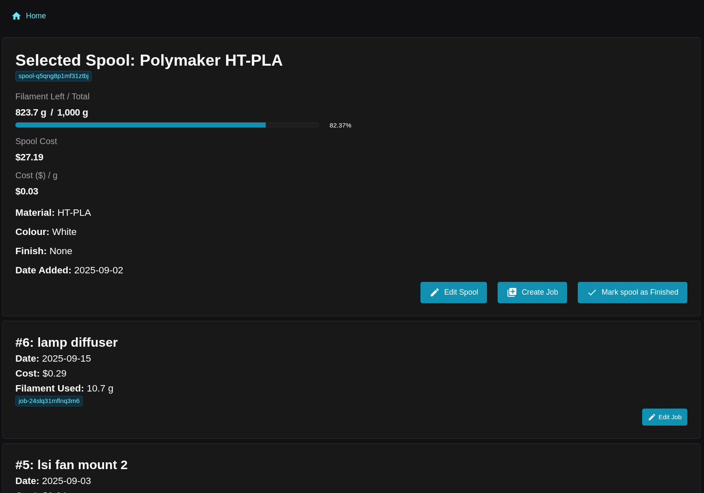
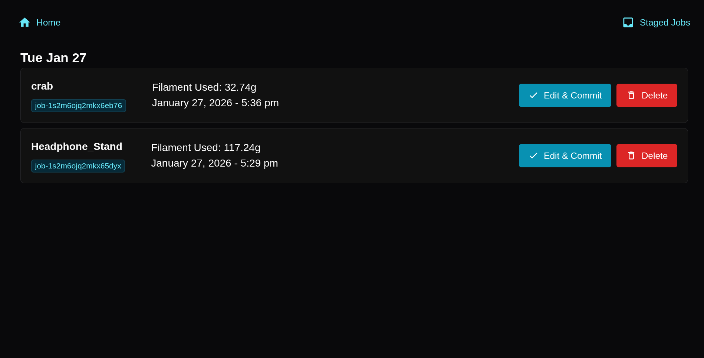
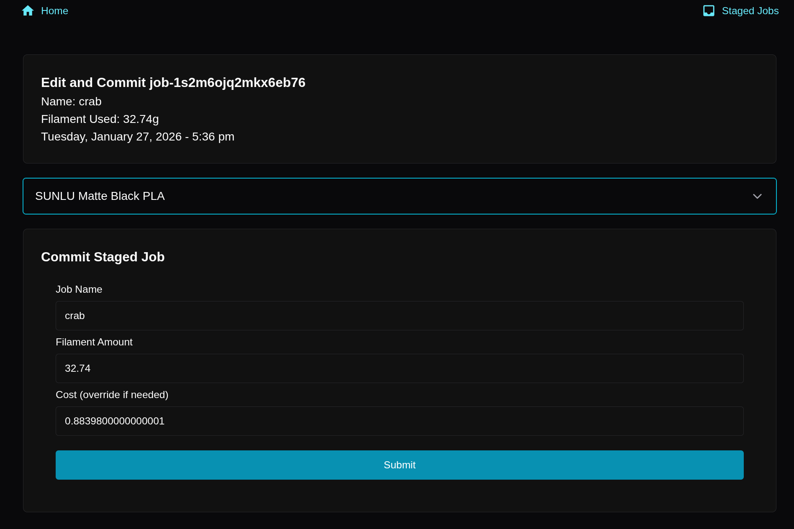

# Filament Manager
Manage filament for 3d printing. Use with https://github.com/TimothyLai77/filament-manager-orcaslicer-script as a post processing script in Orcaslicer to auto send staged jobs to Filamanet Manager. 

# Screenshots

# Installation (Docker):
1. copy `template.env` into a `.env` and change the database password.
2. (Optional) Change the app port in the `.env`
2. `docker compose up -d`

# Installation (Manual):
NOTE: I don't personally use this, and haven't tested it with an external database, all of my development, testing and production versions of filament manager use a dockerised version of postgres17. And I can easily just copy and paste the env file and that auto creates the user + database. Then Sequlize migrations handles the table creations/changes. 

1. copy `template.env` into a `.env` and change the database password.
2. (Optional) Change the app port in the `.env`
3. Set up the credentials, database and the tables in Postgres manually. (see [migrations](server/migrations) for tables and changes applied.)
4. Go into the `/filament-manager/frontend` and `npm install` followed by `npm run build`
5. Go into `/filament-manager/server` and `npm install`.
6. `node server.js`

* I probably forgot something to be honest, I use docker to run the app. 